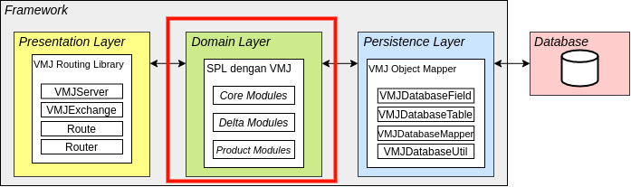
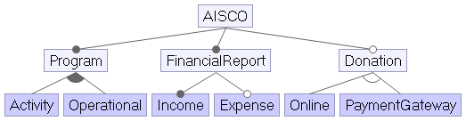

# How To Develop - WinVMJ

Berisi panduan atau langkah-langkah pengembangan product line dan produk-produk back-end turunannya menggunakan WinVMJ. Pada WinVMJ, bagian yang perlu dibangun oleh developer ialah domain layer, yang berisi core module, delta module, dan modul produk.



## Getting Started

Panduan ini dilakukan dengan membangun sebuah product line bernama AISCO yang memiliki diagram fitur di bawah.



Akan dijelaskan bagaimana langkah-langkah pembuatan modul fitur hingga product generation yang terdiri dari:

1. Membangun Modul Fitur
    * Membangun Core Module
    * Membangun Delta Module
    * Membangun Factory Class
    * Pada setiap modul fitur, dapat ditambahkan fitur seperti:
        * Konfigurasi agar method dapat dipanggil melalui HTTP request
        * Konfigurasi Class Menjadi Tabel pada Database
        * Konfigurasi Field Spesial Menjadi Kolom pada Database
        * Konfigurasi Hak Akses untuk Role-Based Access Control
2. Membangun Modul Produk
    1. Feature Selection pada Berkas module-info.java Milik Produk
    2. Membangun Main Class yang Berisi:
        1. Generate Tabel
        2. Aktivasi Server
        3. Generate CRUD Endpoint
        4. Membuat Objek Fitur & Membuat Endpoint Milik Objek Fitur

## Membangun Modul Fitur

Modul fitur yang dimaksud ialah core module dan delta module dari suatu fitur. Contohnya, untuk fitur Financial Report modul-modul fitur yang akan dibangun ialah satu core module dan dua delta module untuk masing-masing variasi (income dan expense). Pembuatan core module dan delta module dilakukan sesuai dengan kaidah VMJ, yaitu memanfaatkan decorator pattern untuk memodifikasi implementasi serta factory pattern untuk memilih implementasi fitur yang tepat.

### Konfigurasi agar Method dapat Dipanggil Melalui HTTP Request

Pada modul fitur, terdapat method-method yang mungkin ingin dapat dipanggil melalui HTTP request. Untuk method yang demikian, lakukan hal-hal berikut:

1. Menggunakan anotasi @Route pada method dengan mengisi parameter bernama "url" sebagai suffix dari endpoint untuk memanggil method
2. Method perlu memberikan output yang bertipe salah satu di antara String, HashMap<String,Object>, atau List<HashMap<String,Object>>
3. Method harus menerima sebuah parameter berupa objek dari class VMJExchange milik [VMJ Routing Library](VMJRoutingLibrary.MD)

Contoh method:

```java
@Route ( url ="partners")
public List <HashMap<String,Object>> getPartnerDatas (VMJExchange vmjExchange) {
    ...
}
```

Dengan begitu, method getPartnerDatas dapat diakses melalui endpoint dengan suffix "partners".

### Konfigurasi Class Menjadi Tabel pada Database

Pada modul fitur, class-class dapat dipetakan menjadi sebuah tabel pada database dengan cara menambahkan anotasi @VMJDatabaseTable milik [VMJ Object Mapper](VMJObjectMapper.MD) dengan mengisi parameter bernama "tableName" sebagai nama tabel pada database dari class yang diberikan anotasi.

Contoh:

```java
@VMJDatabaseTable (tableName ="financialreport_core")
public class FinancialReportImpl extends FinancialReportComponent {
...
}
```

Dengan begitu, class FinancialReportImpl akan dipetakan menjadi tabel bernama financialreport_core yang berisi field-field di dalamnya.

### Konfigurasi Field Spesial Menjadi Kolom pada Database

Pada defaultnya, field akan dipetakan menjadi kolom dari class yang menampungnya. Tetapi, ada beberapa field yang spesial, seperti memiliki beberapa peran lebih pada tabel database berelasi. Untuk itu, digunakan anotasi @VMJDatabaseField pada field demikian dengan memberikan parameter sebagai berikut.

| Parameter Ke- | Nama Parameter | Penjelasan | Tipe       |
|---------------|----------------|------------|------------|
|1| primaryKey | Field merupakan primary key | Boolean |
|2| foreignTableName | nama tabel yang dirujuk jika suatu field merupakan foreign key kepada tabel lain. | String |
|3| foreignColumnName | nama kolom dari tabel yang dirujuk jika suatu field merupakan foreign key kepada tabel lain. | String |
|4|isDelta | menandakan bahwa sebuah field merupakan field yang berasal dari delta module. | Boolean |

Contoh:

```
@VMJDatabaseField(foreignTableName = "program_core", foreignColumnName = "id")
public Program idProgram;
```

Dengan begitu, pada tabel database, kolom bernama "idProgram" akan bertindak sebagai foreign key terhadap kolom bernama "id" milik tabel bernama "program_core".

### Konfigurasi Hak Akses untuk Role-Based Access Control

Pada modul fitur, class dan method dapat dipetakan sehingga bisa diakses melalui suatu URL.
Jika suatu class dibuka untuk akses melalui URL, class tersebut akan dipetakan melalui URL-URL CRUD (Create, Read/List, Update, Delete).
Suatu method juga dapat dipetakan ke suatu URL dengan memanfaatkan anotasi `@Route` yang dimiliki `vmj.routing.route`.

Secara default, semua orang bisa mengakses method/class yang telah dipetakan dengan suatu URL.
Jika ada kebutuhan untuk membatasi akses pengguna terhadap suatu method/class dengan menggunakan konsep Role-Based Access Control, library `prices.auth.vmj` telah menyediakan beberapa anotasi untuk memetakan method/class terhadap suatu permission.

1.  Untuk tingkat Implementation Class (CRUD): Gunakan anotasi `@RestrictCRUD`
    | Parameter Ke- | Nama Parameter | Penjelasan | Tipe       |
    |---------------|----------------|------------|------------|
    |1| permissionName | Nama permission yang diizinkan mengakses CRUD class. | String |
    |2| allowedMethods | CRUD method apa saja yang diizinkan bagi orang yang memiliki permission tersebut.<br>Contoh: Read (detail) -> CRUDMethod.DETAIL | List of `CRUDMethod` enum |
    |3| customPermissionMethod | Nama method untuk logic restriksi tambahan (contoh: object-level permission), untuk membatasi bahwa hanya pengguna yang memiliki permission dan memenuhi logic tersebut yang berhak akses. | String (optional) |

    Sedangkan untuk `CRUDMethod` ada 5 tipe enum:
    | Tipe Ke- | Nama Tipe | Penjelasan |
    |---------------|----------------|------------|
    |1| GET | Metode CRUD untuk mengambil detail suatu objek. |
    |2| LIST | Metode CRUD untuk mengambil daftar objek dalam suatu tabel. |
    |3| POST | Metode CRUD untuk menyimpan suatu objek baru. |
    |4| PUT | Metode CRUD untuk mengganti konten dari suatu objek. |
    |5| DELETE | Metode CRUD untuk menghapus suatu objek. |

    Contoh:
    ```java
    import prices.auth.vmj.annotations.*;
    import prices.auth.vmj.enums.CRUDMethod;
    import vmj.routing.route.VMJExchange;
    @RestrictCRUD(
        permissionName="ModifyProgramImpl",
        allowedMethod={CRUDMethod.POST, CRUDMethod.PUT, CRUDMethod.DELETE},
        customPermissionMethod="checkProgramCreator"
    )
    public ProgramImpl extends ProgramComponent {
        ....

        public static boolean checkProgramCreator(VMJExchange exchange) {
            // check user = program.author
        }
    }
    ```
    Operasi create, update, dan delete untuk class `ProgramImpl` hanya boleh diakses oleh pengguna yang memiliki permission `ModifyProgramImpl` **dan** memenuhi prasyarat bahwa dia adalah author dari program tersebut.

    Suatu class juga bisa memiliki lebih dari satu permission yang membatasi akses. Untuk mengakomodasi hal tersebut, dapat digunakan anotasi `@CRUDRestrictions`.
    | Parameter Ke- | Nama Parameter | Penjelasan | Tipe       |
    |---------------|----------------|------------|------------|
    |1| restrictions | Daftar anotasi `RestrictCRUD` yang membatasi hak akses class tersebut. | List of `RestrictCRUD` |

    Contoh:
    ```java
    import prices.auth.vmj.annotations.*;
    import prices.auth.vmj.enums.CRUDMethod;
    import vmj.routing.route.VMJExchange;
    @CRUDRestrictions(restrictions={
        RestrictCRUD(
            permissionName="ModifyProgramImpl",
            allowedMethod={CRUDMethod.POST, CRUDMethod.PUT, CRUDMethod.DELETE},
            customPermissionMethod="checkProgramCreator"
        ),
        RestrictCRUD(
            permissionName="ShowProgramImpl",
            allowedMethod={CRUDMethod.LIST, CRUDMethod.DETAIL}
        )
    })
    public ProgramImpl extends ProgramComponent {
        ....

        public static boolean checkProgramCreator(VMJExchange exchange) {
            // check user = program.author
        }
    }
    ```

    Selain CUD yang dibatasi oleh `ModifyProgramImpl` dan custom permission method `checkProgramCreator`, operasi List dan Detail kini juga dibatasi oleh permission `ShowProgramImpl`.


2.  Untuk tingkat Method: Gunakan anotasi `@Restricted`
    | Parameter Ke- | Nama Parameter | Penjelasan | Tipe       |
    |---------------|----------------|------------|------------|
    |1| permissionName | Nama permission yang diizinkan mengakses CRUD class. | String |
    |3| customPermissionMethod | Nama method untuk logic restriksi tambahan (contoh: object-level permission), untuk membatasi bahwa hanya pengguna yang memiliki permission dan memenuhi logic tersebut yang berhak akses. | String (optional) |

    Contoh:
    ```java
    @Route(url="/program/rate")
    @Restricted(permissionName="RateProgramImpl")
    public void rate(VMJExchange exchange) {
        ....
    }
    ```
    Method `rate` hanya boleh diakses oleh pengguna yang memiliki permission `RateProgramImpl`.

    Suatu method juga bisa memiliki lebih dari satu permission yang membatasi akses. Untuk mengakomodasi hal tersebut, dapat digunakan anotasi `@Restrictions`.
    | Parameter Ke- | Nama Parameter | Penjelasan | Tipe       |
    |---------------|----------------|------------|------------|
    |1| restrictions | Daftar anotasi `Restricted` yang membatasi hak akses method tersebut. | List of `Restricted` |

    Contoh:
    ```java
    @Restrictions(restrictions={
        Restricted(
            permissionName="RateProgramImpl"
        ),
        Restricted(
            permissionName="ModifyProgramImpl",
            customPermissionMethod="checkProgramCreator"
        )
    })
    public void rate(VMJExchange exchange) {
        ....
    }

    public static boolean checkProgramCreator(VMJExchange exchange) {
        // check user = program.author
    }
    ```

    Selain dibatasi oleh `RateProgramImpl`, kini method `rate` juga dibatasi oleh `ModifyProgramImpl` dengan custom permission method `checkProgramCreator`.


### Penerapan Factory Pattern

Dilakukan dengan membangun factory class yang berisi factory method di setiap fiturnya. Contoh factory method:

```java
public static Program createProgram(String fullyQualifiedName, Object... base) {
    Program record = null;
    try {
        Class<?> clz = Class.forName(fullyQualifiedName);
        Constructor<?> constructor = clz.getDeclaredConstructors()[0];
        record = (Program) constructor.newInstance(base);
    } catch (IllegalArgumentException e) {
        ...
    } catch (ClassCastException e) {
        ...
    } catch (ClassNotFoundException e) {
        ...
    } catch (Exception e) {
        ...
    }
    return record;
}
```

## Membangun Modul Produk

Setiap produk yang ingin dibangun direpresentasikan dalam sebuah Java Module. Dalam setiap modul produk akan dijalankan beberapa hal, yaitu:
1. Feature Selection pada Berkas module-info.java Milik Produk
2. Membangun Main Class yang Berisi:
    1. Generate Tabel
    2. Aktivasi Server
    3. Generate CRUD Endpoint
    4. Membuat Objek Fitur & Membuat Endpoint Milik Objek Fitur

### Feature Selection pada Berkas module-info.java Milik Produk

Deklarasikan dependensi terhadap modul-modul fitur yang ingin digunakan. Contoh:

```java
module aisco.financialreport.income {
    requires aisco.financialreport.core;
    exports aisco.financialreport.income;
    requires vmj.routing.route;
    requires vmj.hibernate.integrator;
    requires prices.auth.vmj;

    opens aisco.financialreport.income to gson;
}
```

### Membangun Main Class: Generate Tabel

Generate table saat ini sudah di-handle oleh sistem Hibernate yang terletak di library [Hibernate Integrator](README_HIBERNATE.MD). Setiap component dan impl baru dari sebuah model perlu diberikan anotasi `@Table` dan `@Entity` dengan field name masing-masing seperti `@Entity(name=financialreport_impl)`, lalu pastikan model baru tersebut dimasukkan ke dalam main file dari product yang ingin dibuat seperti ini: 
```java
configuration.addAnnotatedClass(aisco.program.core.Program.class);
```

### Membangun Main Class: Aktivasi Server

Dilakukan dengan:
1. Inisiasi objek VMJServer milik [VMJ Routing Library](VMJRoutingLibrary.MD) dengan memanggil static method getInstance dengan memberikan nama host serta nomor port. Contoh:

```java
VMJServer vmjServer = VMJServer.getInstance("localhost", 8000);
```

2. Memanggil method startServerGeneric milik VMJServer. Contoh:

```java
vmjServer.startServerGeneric();
```

Dengan begitu, pasangan nama host dan nomor port pada mesin akan digunakan untuk kepentingan aplikasi.

### Membangun Main Class: Generate CRUD Endpoint

CRUD Endpoints sekarang sudah di-generate secara otomatis pada main file sebuah product. Pastikan bahwa ada instansiasi resource class ingin yang ditambahkan endpointnya disusul dengan pemanggilan Router.route() pada main file product, dan semua endpoint akan di-generate secara otomatis saat server dijalankan.

```java
FinancialReportResource financialreport = FinancialReportResourceFactory
			.createFinancialReportResource(
			"aisco.financialreport.core.FinancialReportResourceImpl"
			);
		FinancialReportResource income = FinancialReportResourceFactory
			.createFinancialReportResource(
			"aisco.financialreport.income.FinancialReportResourceIncomeDecorator"
			,
			FinancialReportResourceFactory.createFinancialReportResource(
			"aisco.financialreport.core.FinancialReportResourceImpl"));
Router.route(income);
```

Jika berhasil, maka saat server berjalan akan ditampilkan daftar semua endpoint yang bisa diakses. Umumnya, endpoints ini menggunakan format nama /call/FEATURE_NAME/(detail/list/save/update/delete).

### Membangun Main Class: Membuat Objek Fitur & Membuat Endpoint Milik Objek Fitur

Membuat objek fitur dilakukan dengan memanggil factory method. Contoh:

```java
Program activity = ProgramFactory.POSTProgram("aisco.program.activity.ProgramImpl");
```

Membuat endpoint milik objek fitur dilakukan dengan memanggil method bindMethod milik VMJServer. Contoh:

```java
Router.bindMethod("setExecutionDate", activity);
```

Dengan begitu, method setExecutionDate akan dapat dipanggil melalui HTTP Request sesuai dengan suffix yang dituliskan pada method.


## Closing

Dilanjutkan dengan tahap [Building](README.MD#building)
