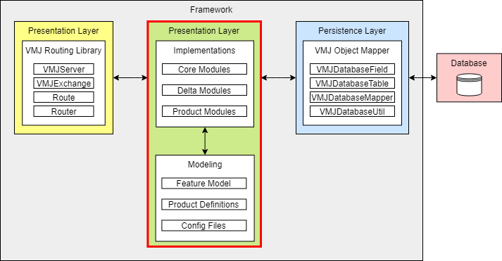
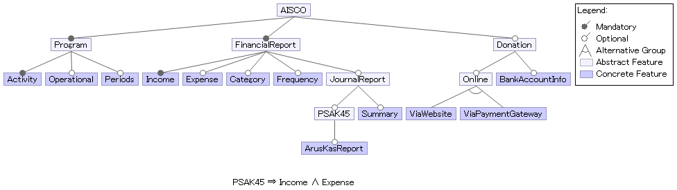
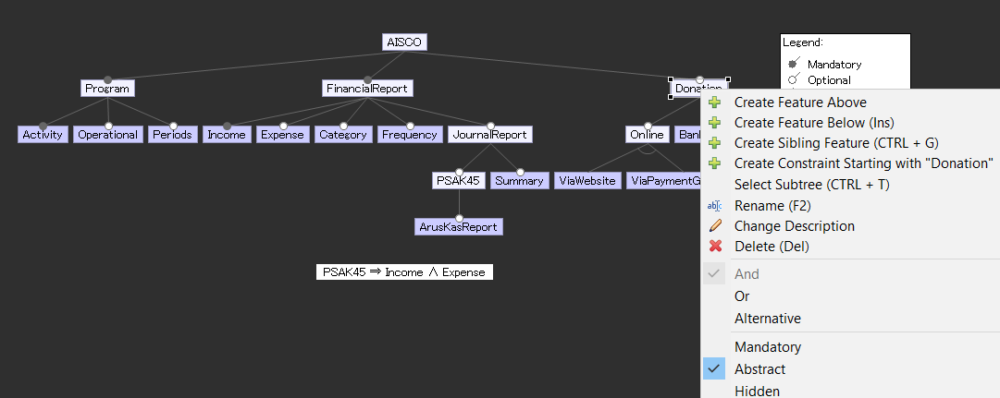
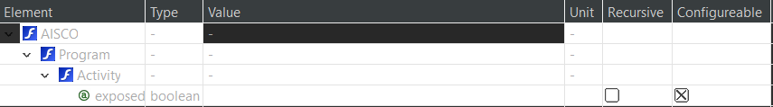
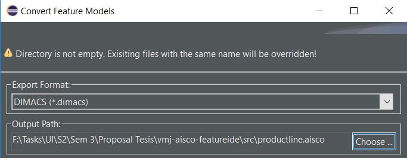
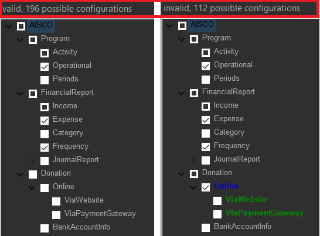
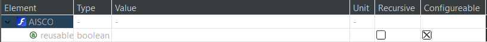

# How To Develop - WinVMJ

Berisi panduan atau langkah-langkah pengembangan product line dan produk-produk back-end turunannya menggunakan WinVMJ. Pada WinVMJ, bagian yang perlu dibangun oleh developer ialah domain layer yang terdiri dari implementasi dan modeling. Bagian modeling terdiri dari feature model, config files, dan product configuration, sementara domain layer terdiri dari core module, delta module, dan modul produk.



## Getting Started

Panduan ini dilakukan dengan membangun sebuah product line bernama AISCO yang memiliki diagram fitur di bawah.



Akan dijelaskan bagaimana langkah-langkah pembuatan modul fitur hingga product generation yang terdiri dari:

1. Mengelola Modeling Product Line
    * Membuka Modeling Project dengan Eclipse
	* Pendefinisian Atribut Fitur
	* Mengelola berkas konfigurasi
2. Membangun Modul Fitur
    * Membangun Core Module
    * Membangun Delta Module
    * Membangun Factory Class
    * Pada setiap modul fitur, dapat ditambahkan fitur seperti:
        * Konfigurasi agar method dapat dipanggil melalui HTTP request
        * Konfigurasi Class Menjadi Tabel pada Database
        * Konfigurasi Field Spesial Menjadi Kolom pada Database
        * Konfigurasi Hak Akses untuk Role-Based Access Control
3. Membangun Modul Produk dengan Feature Selection pada Modeling Project

Selain itu, terdapat juga langkah opsional berupa pengelolaan Main Class secara manual, yang terdiri dari:
1. Generate Tabel
2. Aktivasi Server
3. Generate CRUD Endpoint
4. Membuat Objek Fitur & Membuat Endpoint Milik Objek Fitur

## Mengelola Modeling Product Line
Modeling Product Line merupakan suatu ``FeatureIDE`` project yang memodelkan fitur-fitur dari suatu ``product line`` WinVMJ. Selain itu, pada project ini terdapat konfigurasi pemetaan untuk menyusun produk dan kumpulan product definition dimana proses feature selection produk disimpan. Pengelolaan ini membutuhkan plug-in ``FeatureIDE`` pada Eclipse, jadi pastikan anda sudah memiliki kedua perangkat tersebut (lihat kembali [Prerequisites](README.MD#Prerequisites)).

### Membuka Modeling Project dengan Eclipse
Berikut langkah yang perlu anda lakukan untuk membuka modeling project pada Eclipse.
1. Buka Eclipse IDE anda.
2. Pilih menu ``File``>``Open Project from File System...``.
3. Silahkan browse direktori ``productline.aisco`` menggunakan opsi ``Directory``.

4. Klik ``Finish``.

Anda akan diarahkan ke menu Feature Model Editor seperti di bawah ini.


Terlihat editor memiliki fitur ketika anda mengklik salah satu node. Beberapa yang sering digunakan pada development adalah:
- Create Feature: membuat feature node baru dengan posisi relatif terhadap node yang diklik.
  - Above: node baru setingkat di bawah node yang diklik
  - Below: node baru setingkat di bawah node yang diklik
  - Sibling: hirarki node baru sama dengan node yang diklik
- Rename: mengganti nama fitur yang diklik
- Mandatory: checklist yang mengharuskan fitur ini dipilih jika parentnya dipilih
- Abstract: checklist yang mendefinisikan sifat abstrak pada fitur
- Or, And, Alternative: checklist yang mendefinisikan relasi antar child yang dimiliki fitur. Hanya dapat memilih salah satu.

Jika anda tertarik untuk membuat product line baru. Anda bisa melakukannya dengan cara:
1. Buat folder baru pada root project dengan format: ``productline.[nama product line dengan lowercase]``. Contoh: ``productline.example``.
2. Pilih menu ``File``>``New``>``Other...``
3. Silahkan pilih ``FeatureIDE``>``FeatureIDE Project``
4. Silahkan pilih ``Feeature Modelling`` sebagai composer, dan namakan configuration path sebagai ``products`` seperti di bawah ini.

5. Sesuaikan nama dan lokasi project dengan nama folder yang baru anda buat, seperti di bawah ini.

6. Anda akan diarahkan pada feature model editor.
7. Ubah nama root feature menjadi nama product line yang anda definisikan tanpa mengikuti aturan lowercase. Contoh: jika tadi anda menamai folder anda ``productline.example``, maka anda mengganti root feature dengan nama ``Example`` atau ``example``.

### Pendefinisian Atribut Fitur
Selain itu, anda dapat mengelola atribut dari suatu fitur dengan menampilkan editor feature attribute. Caranya dengan:
1. Pilih menu ``Window``>``Show View``>``Other...``
2. Pilih folder ``FeatureIDE``, kemudian pilih ``Feature Attributes``
3. Kembali ke Feature Model dan klik salah satu fitur
4. Nantinya di ``feature attribute`` editor akan muncul hirarki menuju fitur tersebut dan atribut yang dimiliki

Berikut contoh tampilan fitur ``Activity`` pada ``feature attribute`` editor


Untuk sementara, Feature Model hanya membutuhkan atribut ``reusable`` pada root (AISCO). Atribut ini akan mengekspos semua module yang dibutuhkan semua produk dengan menambahkan prefix ``transitive`` pada ``module-info`` yang digenerate dari konfigurasi produk. Karena bergantung dari konfigurasi produk, atribut ini bersifat configurable dan akan diisi nilainya pada proses konfigurasi produk.

Jika ingin mencoba-coba, anda dapat menambahkan atribut baru dengan mengklik fitur yang anda inginkan, kemudian pindah ke feature attribute editor. Kemudian klik kanan pada fitur diinginkan. Akan ada empat pilihan tipe atribut: string, boolean, long, dan double.

### Mengelola Berkas Konfigurasi
Ada empat berkas konfigurasi tambahan untuk membantu proses development modul dan produk menggunakan feature model, yaitu:

### ``models.dimacs``
Berisi berkas ``dimacs`` untuk validasi ulang pada proses generate product module. Berkas ini perlu dibuat dan diupdate setiap kali melakukan perubahan susunan fitur pada feature model. Caranya:
1. Buka Eclipse IDE.
2. Klik kanan pada project folder ``productline.aisco``.
3. Pilih menu ``FeatureIDE``>``Export All Feature Models``.
4. Silahkan save dengan format ``dimacs`` dan pilih lokasi project ``productline.aisco`` seperti di bawah ini.


#### ``product_config.json``
Berkas ini berisi pemetaan fitur dan modul. Berkas ini menjadi panduan pemilihan modul berdasarkan feature selection. Berikut snippet tampilan berkas tersebut.
```json
{
	"Program": ["aisco.program.core"],
	"Activity": ["aisco.program.activity"],
...
	"JournalReport": ["aisco.automaticreport.core", "aisco.chartofaccount.core"],
...
}
```
Terlihat konfigurasi memiliki format: ``Nama Fitur``: ``[daftar modul]``. Relasi fitur dengan modul bersifat many-to-many, dimana satu fitur dapat memilih beberapa modul dan satu modul dapat dipilih beberapa fitur. Pastikan anda memetakan setiap modul yang anda develop pada berkas ini.

#### ``module_config.json``
Berkas ini berisi requirement terkait konfigurasi aplikasi pada product module. Berikut snippet tampilan berkas ini.
```json
{
	"dataModel": [
		"aisco.program.core",
		"aisco.program.activity",
...
	],
	"methodRouting": [
...
		"aisco.donation.core",
		"aisco.donation.pgateway"
	]
}
```
Terlihat konfigurasi memiliki dua key:
- ``dataModel``: berisi kumpulan modul yang memerlukan konfigurasi database dan CRUD endpoint. Silahkan cantumkan module yang memerlukan persistance layer untuk menyimpan data. Perlu anda ketahui, sebuah modul ``a.b.c`` yang tercantum dalam key ini akan memiliki:
  - Table database bernama ``b_c``.
  - CRUD endpoint tergantung jenis modul:
    - Core module akan memiliki endpoint: ``call/[hyphen B class]``. B class merupakan class yang terdapat pada ``a.b.c.B.java``.
	- Delta module akan memiliki endpoint: ``call/[c]``. **Terdapat keterbatasan dimana ``c`` akan selalu dianggap satu kata. Jika and memiliki kebutuhan khusus, bisa melakukan kustomisasi product module dengan melihat [panduan ini](## Opsional: Pengelolaan Main Class)**.
- ``methodRouting``: berisi kumpulan modul yang memerlukan proses routing pada method yang ada pada implementasi. Silahkan cantumkan module yang memiliki setidaknya satu anotasi ``@Route``. Perlu anda ketahui, , sebuah modul ``a.b.c`` yang tercantum dalam key ini akan memiliki endpoint baru sesuai dengan anotasi ``@Route``.

## Membangun Modul Fitur

Modul fitur yang dimaksud ialah core module dan delta module dari suatu fitur. Contohnya, untuk fitur Financial Report modul-modul fitur yang akan dibangun ialah satu core module dan dua delta module untuk masing-masing variasi (income dan expense). Pembuatan core module dan delta module dilakukan sesuai dengan kaidah VMJ, yaitu memanfaatkan decorator pattern untuk memodifikasi implementasi serta factory pattern untuk memilih implementasi fitur yang tepat.

### Struktur Modul Fitur
Core dan delta module memiliki struktur modul yang berbeda.

#### Struktur Modul Core
Jika terdapat core module C, maka strukturnya adalah sebagai berikut:
```
aisco.c.core
├── module-info.java
└── aisco.c
    ├── CFactory.java
	└── core
	    ├── C.java
		├── CComponent.java
		├── CDecorator.java
		└── CImpl.java
```
Berikut penjelasan setiap berkas:
- ``module-info.java``: Mendefinisikan modul dan library luar yang dibutuhkan untuk implementasi semua class pada modul.
- ``CFactory.java``: Class untuk mengenerate object implementasi fitur core C beserta seluruh delta yang memodifikasinya.
- ``C.java``: Interface untuk mendefinisikan seluruh method pada fitur core C. Nantinya
- ``CComponent.java``: Abstract class yang mengimplementasi Interface ``C.java``. Ketentuan implementasinya sebagai berikut:
  - Jika method interface diimplementasi, maka method tersebut bersifat unmodifiable.
  - Jika method interface tidak diimplementasi, maka method tersebut bersifat modifiable.
- ``CDecorator.java``: Abstract class yang mengextend ``CComponent.java``. Merupakan decorator yang dapat diextend oleh delta yang ingin memodifikasi fitur core C.
- ``CImpl.java``: Concrete class yang mengextend ``CComponent.java``. Mengimplementasikan sisa method yang belum diimplementasi oleh ``CComponent.java``. **Jika tidak ada sisa method, tetap implementasikan sebagai class kosong untuk penyeragaman struktur.**

Dihimbau untuk mengikuti konvensi penamaan yang ada. **Ada keterbatasan pada proses generate product module berdasarkan modeling jika mengabaikan hal ini**.

#### Struktur Modul Delta
Jika terdapat delta D yang memodifikasi core C, maka strukturnya adalah sebagai berikut:
```
aisco.c.d
├── module-info.java
└── aisco.c.d
    └── CImpl.java
```
Berikut penjelasan setiap berkas:
- ``module-info.java``: Mendefinisikan modul dan library luar yang dibutuhkan untuk implementasi semua class pada modul.
- ``CImpl.java``: Concrete class yang mengextend ``CDecorator.java`` pada core C. Anda dapat melakukan modifikasi core C menggunakan class ini. Diantaranya:
  - Menambahkan method dan atribut baru
  - Mengimplementasikan abstract method yang ada

Seperti core module, anda juga dihimbau untuk mengikuti konvensi penamaan yang ada. **Ada keterbatasan pada proses generate product module berdasarkan modeling jika mengabaikan hal ini**.

### Konfigurasi agar Method dapat Dipanggil Melalui HTTP Request

Pada modul fitur, terdapat method-method yang mungkin ingin dapat dipanggil melalui HTTP request. Untuk method yang demikian, lakukan hal-hal berikut:

1. Menggunakan anotasi @Route pada method dengan mengisi parameter bernama "url" sebagai suffix dari endpoint untuk memanggil method
2. Method perlu memberikan output yang bertipe salah satu di antara String, HashMap<String,Object>, atau List<HashMap<String,Object>>
3. Method harus menerima sebuah parameter berupa objek dari class VMJExchange milik [VMJ Routing Library](VMJRoutingLibrary.MD)

Contoh method:

```java
@Route ( url ="partners")
public List <HashMap<String,Object>> getPartnerDatas (VMJExchange vmjExchange) {
    ...
}
```

Dengan begitu, method getPartnerDatas dapat diakses melalui endpoint dengan suffix "partners".

### Konfigurasi Class Menjadi Tabel pada Database

Pada modul fitur, class-class dapat dipetakan menjadi sebuah tabel pada database dengan cara menambahkan anotasi @VMJDatabaseTable milik [VMJ Object Mapper](VMJObjectMapper.MD) dengan mengisi parameter bernama "tableName" sebagai nama tabel pada database dari class yang diberikan anotasi.

Contoh:

```java
@VMJDatabaseTable (tableName ="financialreport_core")
public class FinancialReportImpl extends FinancialReportComponent {
...
}
```

Dengan begitu, class FinancialReportImpl akan dipetakan menjadi tabel bernama financialreport_core yang berisi field-field di dalamnya.

**Untuk mempermudah otomasi product module, silahkan ikuti konvensi penamaan tabel berikut ini: jika nama modul merupakan ``a.b.c``, maka nama table menjadi ``b_c``.**

### Konfigurasi Field Spesial Menjadi Kolom pada Database

Pada defaultnya, field akan dipetakan menjadi kolom dari class yang menampungnya. Tetapi, ada beberapa field yang spesial, seperti memiliki beberapa peran lebih pada tabel database berelasi. Untuk itu, digunakan anotasi @VMJDatabaseField pada field demikian dengan memberikan parameter sebagai berikut.

| Parameter Ke- | Nama Parameter | Penjelasan | Tipe       |
|---------------|----------------|------------|------------|
|1| primaryKey | Field merupakan primary key | Boolean |
|2| foreignTableName | nama tabel yang dirujuk jika suatu field merupakan foreign key kepada tabel lain. | String |
|3| foreignColumnName | nama kolom dari tabel yang dirujuk jika suatu field merupakan foreign key kepada tabel lain. | String |
|4|isDelta | menandakan bahwa sebuah field merupakan field yang berasal dari delta module. | Boolean |

Contoh:

```
@VMJDatabaseField(foreignTableName = "program_core", foreignColumnName = "id")
public Program idProgram;
```

Dengan begitu, pada tabel database, kolom bernama "idProgram" akan bertindak sebagai foreign key terhadap kolom bernama "id" milik tabel bernama "program_core".

### Konfigurasi Hak Akses untuk Role-Based Access Control

Pada modul fitur, class dan method dapat dipetakan sehingga bisa diakses melalui suatu URL.
Jika suatu class dibuka untuk akses melalui URL, class tersebut akan dipetakan melalui URL-URL CRUD (Create, Read/List, Update, Delete).
Suatu method juga dapat dipetakan ke suatu URL dengan memanfaatkan anotasi `@Route` yang dimiliki `vmj.routing.route`.

Secara default, semua orang bisa mengakses method/class yang telah dipetakan dengan suatu URL.
Jika ada kebutuhan untuk membatasi akses pengguna terhadap suatu method/class dengan menggunakan konsep Role-Based Access Control, library `prices.auth.vmj` telah menyediakan beberapa anotasi untuk memetakan method/class terhadap suatu permission.

1.  Untuk tingkat Implementation Class (CRUD): Gunakan anotasi `@RestrictCRUD`
    | Parameter Ke- | Nama Parameter | Penjelasan | Tipe       |
    |---------------|----------------|------------|------------|
    |1| permissionName | Nama permission yang diizinkan mengakses CRUD class. | String |
    |2| allowedMethods | CRUD method apa saja yang diizinkan bagi orang yang memiliki permission tersebut.<br>Contoh: Read (detail) -> CRUDMethod.DETAIL | List of `CRUDMethod` enum |
    |3| customPermissionMethod | Nama method untuk logic restriksi tambahan (contoh: object-level permission), untuk membatasi bahwa hanya pengguna yang memiliki permission dan memenuhi logic tersebut yang berhak akses. | String (optional) |

    Sedangkan untuk `CRUDMethod` ada 5 tipe enum:
    | Tipe Ke- | Nama Tipe | Penjelasan |
    |---------------|----------------|------------|
    |1| GET | Metode CRUD untuk mengambil detail suatu objek. |
    |2| LIST | Metode CRUD untuk mengambil daftar objek dalam suatu tabel. |
    |3| POST | Metode CRUD untuk menyimpan suatu objek baru. |
    |4| PUT | Metode CRUD untuk mengganti konten dari suatu objek. |
    |5| DELETE | Metode CRUD untuk menghapus suatu objek. |

    Contoh:
    ```java
    import prices.auth.vmj.annotations.*;
    import prices.auth.vmj.enums.CRUDMethod;
    import vmj.routing.route.VMJExchange;
    @RestrictCRUD(
        permissionName="ModifyProgramImpl",
        allowedMethod={CRUDMethod.POST, CRUDMethod.PUT, CRUDMethod.DELETE},
        customPermissionMethod="checkProgramCreator"
    )
    public ProgramImpl extends ProgramComponent {
        ....

        public static boolean checkProgramCreator(VMJExchange exchange) {
            // check user = program.author
        }
    }
    ```
    Operasi create, update, dan delete untuk class `ProgramImpl` hanya boleh diakses oleh pengguna yang memiliki permission `ModifyProgramImpl` **dan** memenuhi prasyarat bahwa dia adalah author dari program tersebut.

    Suatu class juga bisa memiliki lebih dari satu permission yang membatasi akses. Untuk mengakomodasi hal tersebut, dapat digunakan anotasi `@CRUDRestrictions`.
    | Parameter Ke- | Nama Parameter | Penjelasan | Tipe       |
    |---------------|----------------|------------|------------|
    |1| restrictions | Daftar anotasi `RestrictCRUD` yang membatasi hak akses class tersebut. | List of `RestrictCRUD` |

    Contoh:
    ```java
    import prices.auth.vmj.annotations.*;
    import prices.auth.vmj.enums.CRUDMethod;
    import vmj.routing.route.VMJExchange;
    @CRUDRestrictions(restrictions={
        RestrictCRUD(
            permissionName="ModifyProgramImpl",
            allowedMethod={CRUDMethod.POST, CRUDMethod.PUT, CRUDMethod.DELETE},
            customPermissionMethod="checkProgramCreator"
        ),
        RestrictCRUD(
            permissionName="ShowProgramImpl",
            allowedMethod={CRUDMethod.LIST, CRUDMethod.DETAIL}
        )
    })
    public ProgramImpl extends ProgramComponent {
        ....

        public static boolean checkProgramCreator(VMJExchange exchange) {
            // check user = program.author
        }
    }
    ```

    Selain CUD yang dibatasi oleh `ModifyProgramImpl` dan custom permission method `checkProgramCreator`, operasi List dan Detail kini juga dibatasi oleh permission `ShowProgramImpl`.


2.  Untuk tingkat Method: Gunakan anotasi `@Restricted`
    | Parameter Ke- | Nama Parameter | Penjelasan | Tipe       |
    |---------------|----------------|------------|------------|
    |1| permissionName | Nama permission yang diizinkan mengakses CRUD class. | String |
    |3| customPermissionMethod | Nama method untuk logic restriksi tambahan (contoh: object-level permission), untuk membatasi bahwa hanya pengguna yang memiliki permission dan memenuhi logic tersebut yang berhak akses. | String (optional) |

    Contoh:
    ```java
    @Route(url="/program/rate")
    @Restricted(permissionName="RateProgramImpl")
    public void rate(VMJExchange exchange) {
        ....
    }
    ```
    Method `rate` hanya boleh diakses oleh pengguna yang memiliki permission `RateProgramImpl`.

    Suatu method juga bisa memiliki lebih dari satu permission yang membatasi akses. Untuk mengakomodasi hal tersebut, dapat digunakan anotasi `@Restrictions`.
    | Parameter Ke- | Nama Parameter | Penjelasan | Tipe       |
    |---------------|----------------|------------|------------|
    |1| restrictions | Daftar anotasi `Restricted` yang membatasi hak akses method tersebut. | List of `Restricted` |

    Contoh:
    ```java
    @Restrictions(restrictions={
        Restricted(
            permissionName="RateProgramImpl"
        ),
        Restricted(
            permissionName="ModifyProgramImpl",
            customPermissionMethod="checkProgramCreator"
        )
    })
    public void rate(VMJExchange exchange) {
        ....
    }

    public static boolean checkProgramCreator(VMJExchange exchange) {
        // check user = program.author
    }
    ```

    Selain dibatasi oleh `RateProgramImpl`, kini method `rate` juga dibatasi oleh `ModifyProgramImpl` dengan custom permission method `checkProgramCreator`.


### Penerapan Factory Pattern

Dilakukan dengan membangun factory class yang berisi factory method di setiap fiturnya. Contoh factory method:

```java
public static Program createProgram(String fullyQualifiedName, Object... base) {
    Program record = null;
    try {
        Class<?> clz = Class.forName(fullyQualifiedName);
        Constructor<?> constructor = clz.getDeclaredConstructors()[0];
        record = (Program) constructor.newInstance(base);
    } catch (IllegalArgumentException e) {
        ...
    } catch (ClassCastException e) {
        ...
    } catch (ClassNotFoundException e) {
        ...
    } catch (Exception e) {
        ...
    }
    return record;
}
```

## Membangun Modul Produk dengan Feature Selection pada Modeling Project

Anda dapat melakukan feature selection dengan mengelola berkas feature selection pada ``src/productline.aisco/products``. Anda bisa memulai dengan mengelola tiga berkas yang sudah ada, yaitu ``EdifSchool.xml``, ``Ex2FideSchool.xml``, ``SheilaSchool.xml``. **``EdifSchool.xml`` memang disengaja memiliki konfigurasi tidak valid untuk mendemostrasikan handling konfigurasi yang tidak valid.**

Nantinya akan muncul menu seleksi fitur yang bisa anda pilih. FeatureIDE akan menyesuaikan seleksi fitur dengan konstrain feature model. Akan ada beberapa fitur yang otomatis terpilih dan tidak bisa dipilih berdasarkan konstrain yang telah dipenuhi. Selain itu, FeatureIDE akan memberi tahu apakah konfigurasi tersebut valid atau tidak, dan akan menghighlight penyebab konfigurasi tersebut tidak valid.


Selain itu, anda juga dapat mengatur nilai atribut fitur pada konfigurasi (jika konfigurasi anda berformat ``extended configuration``) menggunakan view feature attribute.


Untuk saat ini, atribut yang menjadi pertimbangan hanyalah ``reusable`` pada ``AISCO``. Silahkan sesuaikan dengan kebutuhan anda.

Jika anda ingin mencoba membuat feature selection baru, caranya adalah:
1. Buka direktori ``src/productline.aisco/`` pada Eclipse. Jika anda lupa, dapat kembali ke section [feature model](### Feature Model)
2. Pada modeling project, klik kanan pada folder ``products``, lalu pilih ``New``>``Other``.
3. Anda akan diarahkan ke menu di bawah ini. Pilih ``FeatureIDE``>``Configuration File``.

4. Anda akan diarahkan ke menu ``new configuration`` untuk membuat product definition baru. Ketentuan product definition WinVMJ-AISCO adalah sebagai berikut:
   - Nama berkas mengikuti konfensi penamaan class pada ``Java`` (diawali dengan huruf kapital di depan). Selebihnya bebas.
   - Format berkas berupa ``extended configuration``, atau ``xml configuration`` jika anda tidak berencana memanfaatkan atribut fitur.


## Buiding

Silahkan lihat di panduan [Building](README.MD#building)

## Opsional: Pengelolaan Main Class

Jika anda memerlukan kebutuhan khusus pada produk anda, maka anda dapat memilih opsi two-stage automation dalam tahap [Building](README.MD#building). Berikut panduan membangun Main Class yang dapat membantu anda dalam proses kustomisasi modul produk anda.

### Membangun Main Class: Generate Tabel

Pada main class milik produk, lakukan generate / memetakan class yang sudah memiliki anotasi @VMJDatabaseClass kepada tabel di database. Dilakukan dengan memanggil method generateTable milik [VMJ Object Mapper](VMJObjectMapper.MD).

Contoh pemanggilan:

```
VMJDatabaseMapper.generateTable("aisco.program.core.ProgramComponent", false);
```

Dengan begitu, class yang memiliki fully qualified name "aisco.program.core.ProgramComponent" dan field di dalamnya akan dipetakan menjadi tabel dan kolom pada database.

### Membangun Main Class: Aktivasi Server

Dilakukan dengan:
1. Inisiasi objek VMJServer milik [VMJ Routing Library](VMJRoutingLibrary.MD) dengan memanggil static method getInstance dengan memberikan nama host serta nomor port. Contoh:

```java
VMJServer vmjServer = VMJServer.getInstance("localhost", 8000);
```

2. Memanggil method startServerGeneric milik VMJServer. Contoh:

```java
vmjServer.startServerGeneric();
```

Dengan begitu, pasangan nama host dan nomor port pada mesin akan digunakan untuk kepentingan aplikasi.

### Membangun Main Class: Generate CRUD Endpoint

Dilakukan dengan memanggil method createTableCRUDEndpoint milik VMJServer.

Contoh pemanggilan:

```java
vmjServer.POSTTableCRUDEndpoint("programs", "program_core", VMJDatabaseMapper.getTableColumnsNames("aisco.program.core.ProgramComponent", false));
```

Dengan begitu, akan terbentuk beberapa jenis endpoint yang digunakan untuk melaksanakan CRUD kepada tabel bernama "program_core", yaitu:

| Suffix Endpoint | Method      | Body Data  | Hasil |
|---------------|----------------|------------|------------|
|1.| /crud/programs | GET     | None | JSON List dari tabel program_core |
|2.| /crud/programs     | POST     | Form Data. Key merupakan kolom pada tabel program_core, dan value merupakan nilai yang ingin diisi | Text "Inserting a data..." dan terisinya tabel program_core |
|3.| /crud/programs/(ID) | GET | None | JSON dari baris yang memiliki ID sama dengan parameter di URL pada tabel program_core |
|4.| /crud/programs/(ID) | PUT | Form Data. Key merupakan kolom pada tabel program_core, dan value merupakan nilai yang ingin diisi | Terubahnya baris dengan ID tersebut dengan data yang dimasukkan |
|3.| /crud/programs/(ID) | DELETE | None | Terhapusnya baris dengan ID tersebut |

Terdapat juga variasi style endpoint lain, yaitu ``ABSCRUD``. Silahkan pelajari lebih lanjut pada panduan [integrasi dengan frontend](HowToIntegrateWithIFML.MD).

### Membangun Main Class: Membuat Objek Fitur & Membuat Endpoint Milik Objek Fitur

Membuat objek fitur dilakukan dengan memanggil factory method. Contoh:

```java
Program activity = ProgramFactory.POSTProgram("aisco.program.activity.ProgramImpl");
```

Membuat endpoint milik objek fitur dilakukan dengan memanggil method bindMethod milik VMJServer. Contoh:

```java
Router.bindMethod("setExecutionDate", activity);
```

Dengan begitu, method setExecutionDate akan dapat dipanggil melalui HTTP Request sesuai dengan suffix yang dituliskan pada method.
