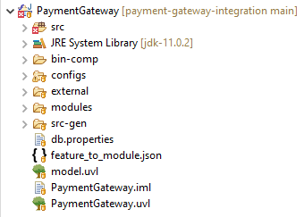
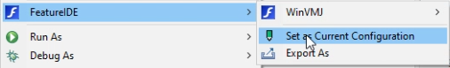
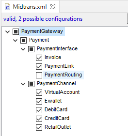
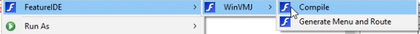
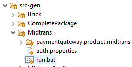
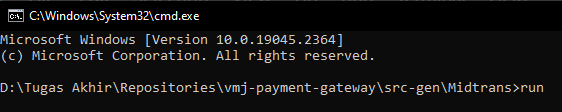

# VMJ Payment Gateway

Repositori ini digunakan untuk menyimpan codebase dari product line Payment Gateway yang dibangun menggunakan kaidah WinVMJ.

## Getting started

Instruksi dibawah adalah langkah-langkah untuk mengenerate sebuah product dari product line Payment Gateway dan menjalankan product yang digenerate dari product line Payment Gateway.

### Prerequisites

1. Java 11
2. Eclipse 2020
3. Plugin FeatureIDE
4. WinVMJ Composer
5. PostgreSQL

### Product Generation
Untuk Product Generation seluruh langkah dilakukan dalam Eclipse. Clone repositori ini lalu import sebagai project baru di Eclipse.

1. Feature Selection  

Pemilihan fitur yang akan dinginkan dalam product diatur oleh file config dalam direktori configs dengan format .XML. Tiap product memiliki file config masing-masing.
Pilih product yang ingin digenerate dengan klik kanan pada file config > FeatureIDE > Set as Current Configuration.

Jika ingin membuat product baru dapat dilakukan dengan meng-copy sebuah file config dengan nama product baru lalu pilih fitur yang diinginkan dengan mencentang checkbox fitur. Fitur dengan centang kotak hitam adalah fitur mandatory akan selalu dipilih.

2. Compile  

Setelah memilih file config dengan Set as Current Configuration, FeatureIDE akan mulai meng-copy modul-modul yang dibutuhkan ke direktori src. Jika tidak hapus seluruh isi src dan Set as Current Configuration ulang. Setelah selesai meng-copy klik kanan pada direktori src > FeatureIDE > WinVMJ > Compile.

WinVMJ Composer akan mulai meng-compile seluruh modul-modul dalam direktori src ditandai dengan pesan dari WinVMJ Console. Jika sudah selesai hasil product akan berada dalam direktori src-gen dengan nama direktori berupa nama file config.

### Product Run
Untuk menjalankan product cukup dengan menjalankan script run dalam direktori product dengan Command Prompt.

