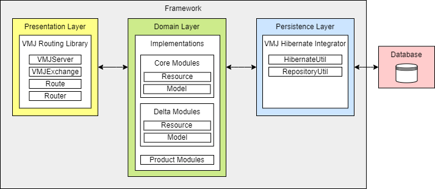

# WinVMJ Code Repository

Repository ini digunakan untuk menyimpan codebase dari product line AISCO yang dibangun menggunakan kaidah WinVMJ.

## WinVMJ

Struktur dari WinVMJ:



Terdiri dari 3 jenis layer, yaitu

1. Presentation Layer

Diatur oleh sebuah library bernama [VMJ Routing Library](VMJRoutingLibrary.MD)

2. Persistence Layer

Diatur oleh sebuah library bernama [VMJ Hibernate Integrator](VMJHibernateIntegrator.MD)

3. Domain Layer

Berisi implementasi product line yang dibangun. Dalam WinVMJ yang berbasis VMJ, domain layer terbagi menjadi dua, yaitu implementation dan modeling. implementation berisi core module, delta module, serta modul produk, sedangkan modeling berisi berkas pemodelan suatu product line dan kumpulan feature selection yang mendefinisikan sebuah produk. Artefak pada modeling layer akan diproses sesuai feature selection yang dipilih untuk mengenerate modul dan aplikasi produk.


## Getting Started

Instruksi di bawah dapat dilakukan untuk proses develop, build dan menjalankan produk-produk yang sudah ada pada repository, yaitu produk bernama Sheila School (aisco.product.sheilaschool) dan angga school (aisco.product.anggaschool). Lakukan clone terhadap repository ini untuk memulai menjalankan produk.

### Prerequisites

1. Java 11 atau di atasnya
2. Berkas JAR dari library WinVMJ: VMJ Hibernate Integrator ([dokumentasi](VMJHibernateIntegrator.MD)), VMJ Routing ([dokumentasi](VMJRoutingLibrary.MD)). Terletak pada folder winvmj-libraries.
3. Berkas JAR dari helper library external: GSON. Terletak pada folder winvmj-libraries.
4. [Eclipse IDE](https://www.eclipse.org/downloads/) (untuk modeling).
5. [FeatureIDE](https://featureide.github.io/) Plug-In pada Eclipse.
6. [PostgreSQL](https://www.postgresql.org/download/) Database Postgresql.


### How To Develop

Langkah-langkah untuk mendevelop aplikasi web menggunakan WinVMJ, yang dapat dilihat pada [How to Develop](HowToDevelop.MD).

Setelahnya, dilanjutkan proses Building.

### Building

1. Pada Postgresql buat database dengan nama yang diinginkan (cth: hibernatedemo)
2. pada file `hibernate.properties` atur `connection.url` agar mengarah pada database yang diinginkan serta sesuaikan `connection.username` dan `connection.password` dengan username dan password yang dimiliki.

3. build dengan menggunakan command :
untuk membuild secara keseluruhan gunakan command
```
bash genproduct.sh [nama modul produk] [nama produk]
```
contohnya :
```
bash genproduct.sh aisco.product.sheilaschool SheilaSchool
```

untuk mengcompile suatu module saja gunakan command
```
bash genmodule.sh  [nama modul produk] [nama modul core atau delta]
```
contohnya :
```
bash genmodule.sh aisco.product.sheilaschool aisco.financialreport.core
```

untuk mengcompile product modulenya saja gunakan command
```
bash genproductmodule.sh  [nama modul produk] [nama main class produk]
```
contohnya :
```
bash genproductmodule.sh aisco.product.sheilaschool SheilaSchool
```

<!-- Izin di komen dulu karena bagian dibawah ini baru bisa jalan ketika sudah disatukan dengan punya samuel -->
<!-- 
Terdapat dua opsi dalam proses building, yaitu:
1. Full Automation
2. Two-Stage Automation

#### Full Automation
Opsi build ini melakukan otomasi penuh dari feature selection pada modeling. Jika anda tidak memiliki kebutuhan khusus dan selalu mengikuti konvensi penamaan, disarankan untuk memakai opsi ini. Proses ini dilakukan dengan mengeksekusi perinah:

```
bash full_build.sh [nama product line] [nama produk config tanpa extension]
```

Contoh:

```
bash full_build.sh AISCO SheilaSchool
```

Jika berhasil, berkas JAR dari produk serta seluruh berkas JAR dari modul yang ter-compile akan berada pada folder nama modul produk. Contoh:

```
.
├── aisco.automaticreport.twolevel.jar
├── aisco.automaticreport.core.jar
├── aisco.chartofaccount.core.jar
├── aisco.donation.core.jar
├── aisco.donation.pgateway.jar
├── aisco.financialreport.core.jar
├── aisco.financialreport.expense.jar
├── aisco.financialreport.income.jar
├── aisco.program.activity.jar
├── aisco.program.core.jar
├── aisco.program.operational.jar
├── SheilaSchool.jar
├── database.properties
├── gson.jar
├── payment.method.core.jar
├── payment.method.dokudua.jar
├── sqlite.jdbc.jar
├── vmj.object.mapper.jar
└── vmj.routing.route.jar
```

Tentunya berkas yang digenerate akan bergantung pada fitur yang dipilih. Namun intinya pada terminal bash akan tertulis hal berikut jika berhasil:

```
Product SheilaSchool is ready
```

#### Two-Stage Automation
Opsi ini memisahkan proses otomasi menjadi dua bagian: generating product module dan generating product JAR. Opsi ini memberi ruang bagi developer untuk mengkustomasi product module yang digenerate dari feature selection karena satu dan lain hal (seperti penamaan tidak sesuai konvensi). Walau perlu diingat bahwa kustomisasi anda akan ter-overwrite jika anda kembali menjalankan proses generating product module pada produk yang anda kustomisasi.

Proses ini dilakukan dengan mengeksekusi perinah generate product module:

```
bash gen_prod_module.sh [nama product line] [nama produk config tanpa extension] [default/template]
```

Nama produk config dapat dilihat pada ``productline.aisco/products``, silahkan masukkan nama konfigurasi **tanpa extension ``.xml``**. Berikutnya terdapat argumen ``default/template``. Ini akan mempengaruhi ``Product Class`` yang digenerate. ``default`` akan menghasilkan implementasi penuh, sementara ``template`` akan memberikan implementasi parsial. Silahkan pelajari cara kustomisasinya pada bagian [Pengelolaan Main Class](HowToDevelop_v2.MD). Berikut contoh perintah valid:

```
bash gen_prod_module.sh AISCO Ex2FideSchool default
```

Jika sukses, maka anda unix shell akan menghasilkan log berikut:
```
java -jar runnables/vmj.fmp.parser.jar src/productline.aisco/ Ex2FideSchool src/ default
Reading feature model...
Reading complete!
Analyzing feature model...
The feature model looks fine.
Parsing feature model...
Parsing complete!
Reading configuration...
Reading complete!
Analyzing configuration...
Seems like a valid configuration.
Specifying Product.
Product Specified. The spec is as follows:
Product Name: Ex2FideSchool
Package Name: aisco.product.ex2fideschool
Required Modules:
transitive aisco.program.core
transitive aisco.program.activity
transitive aisco.program.operational
aisco.financialreport.core
aisco.financialreport.income
aisco.financialreport.expense
```

Kemudian anda melakukan proses generating JAR dengan menjalankan perintah:

```
bash build_product.sh [nama product line] [nama produk config tanpa extension]
```

Contoh:

```
bash build_product.sh AISCO SheilaSchool
```

Hasilnya akan mirip dengan JAR hasil proses Full Automation. -->

### Authorization Management

Beberapa fitur membutuhkan proses otorisasi. Silahkan ubah berkas ``auth_seed.sql`` untuk mendefinisikan akun anda agar dapat dikenali pada proses otorisasi dan otentikasi. Pada berkas tersebut, silahkan tambahkan sql command ini:
```
INSERT INTO auth_user (id,password,allowedPermissions,name,email) VALUES ([unique integer],'fd4f97ae96ed4c0268d0b275765c849ce511419d96d6290ed583b9516f8cab61dfeddf43a522167bc9fa1eaeebb72b88158a2e646d1006799eb65a0e5805341a','',[Nama anda],[email google anda]);
```

Contoh:
```
INSERT INTO auth_user (id,password,allowedPermissions,name,email) VALUES (5,'fd4f97ae96ed4c0268d0b275765c849ce511419d96d6290ed583b9516f8cab61dfeddf43a522167bc9fa1eaeebb72b88158a2e646d1006799eb65a0e5805341a','','Samuel Tupa Febrian','samuel.febrian@gmail.com');
```

**Mohon diperhatikan bahwa kolom id harus bernilai unik, sehingga perlu diperhatikan data lain.**

Kemudian assign role akun anda sesuai kebutuhan dengan menambahkan sql command:
```
INSERT INTO auth_user_role (id,role,user) VALUES ([unique integer],[id role],[id user]);
```

Contoh:
```
INSERT INTO auth_user_role (id,role,user) VALUES (13,1,5);
```

Silahkan assign role yang dibutuhkan.

### Running the product

Untuk menjalankan produk yang sudah dibangun, jalankan perintah berikut:

```
bash run.sh [nama product line] [nama produk]
```

Contoh:

```
bash run.sh AISCO SheilaSchool
```

Jika berhasil, seluruh perintah pada main class milik produk akan dijalankan, salah satunya akan akan tertulis endpoint-endpoint yang dapat dipanggil melalui HTTP request pada bash. Contoh:

```
http://localhost:7776/call/summary/list
```


### Tambahan: Seeding

Jika anda membutuhkan data seed (terutama terkait otorisasi), anda bisa menggunakan skrip ``read_sql.sh11 dengan cara:

```
bash read_sql.sh [nama role di postgre] [passwordnya] [nama database] [lokasi file seeding]
```

Contoh (sangat direkomendasikan untuk dieksekusi karena menyangkut otorisasi):
```
bash read_sql.sh postgres admin hibernatedemo auth_seed.sql
```

Untuk data seed lainnya, dapat dilihat pada direktori ``sql``. Contohnya :
```
bash read_sql.sh postgres admin hibernatedemo ./sql/Program-hibernate.sql
```


## Authors

* **Hanif Agung Prayoga** - *Initial work* - [WinVMJ](https://gitlab.com/RSE-Lab-Fasilkom-UI/PricesIDE/vmj-aisco)
* **Falah Prasetyo Waluyo** - *Integrating Hibernate ORM to WinVMJ* - [WinVMJ](https://gitlab.com/RSE-Lab-Fasilkom-UI/PricesIDE/vmj-aisco)
* **Ichlasul Affan** - *Authorization support* - [WinVMJ-Lib](https://gitlab.com/RSE-Lab-Fasilkom-UI/PricesIDE/vmj-libraries)
* **Samuel Tupa Febrian** - *Feature Modelling and Selection* - [WinVMJ](https://gitlab.com/RSE-Lab-Fasilkom-UI/PricesIDE/vmj-aisco/-/tree/featureide-dev) & [WinVMJ-Lib](https://gitlab.com/RSE-Lab-Fasilkom-UI/PricesIDE/vmj-libraries/-/tree/featureide-parser/dev)
* **Christopher Samuel** - *Further implementation on case study and add further changes to WinVMJ-Libraries' modules* - [WinVMJ](https://gitlab.com/RSE-Lab-Fasilkom-UI/PricesIDE/vmj-aisco) & [WinVMJ-Lib](https://gitlab.com/RSE-Lab-Fasilkom-UI/PricesIDE/vmj-libraries/-/tree/VMJExchange-HttpMethods)

## Acknowledgments

* Maya Retno Ayu Setyautami and Reiner Hähnle. 2021. **An Architectural Pattern to Realize Multi Software Product Lines in Java**. _In 15th International Working Conference on Variability Modelling of Software-Intensive Systems (VaMoS'21)_. ACM. DOI:https://doi.org/10.1145/3442391.3442401
